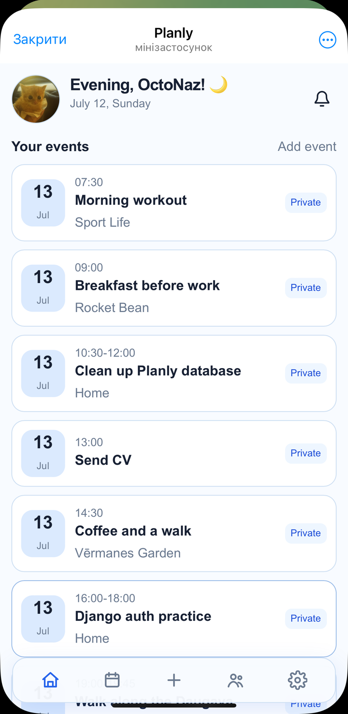
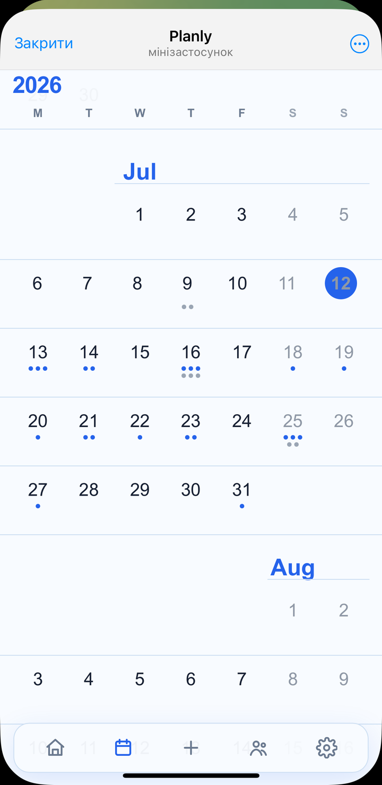
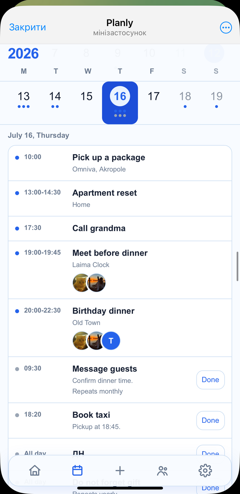
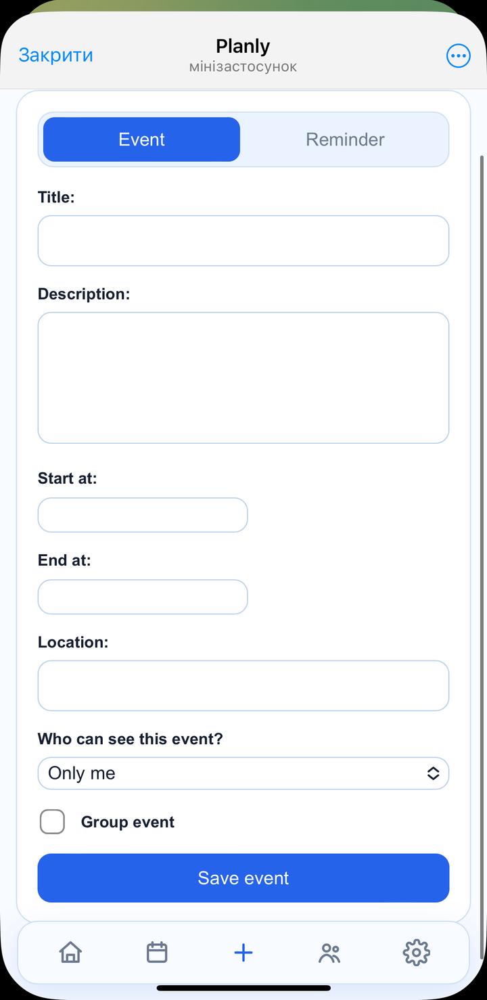
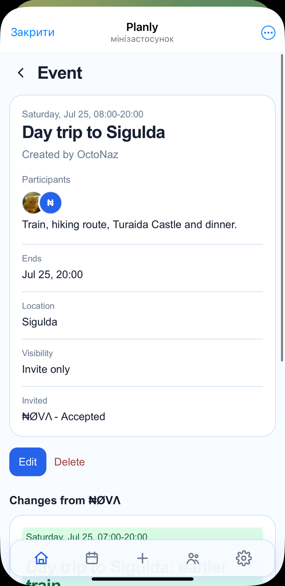
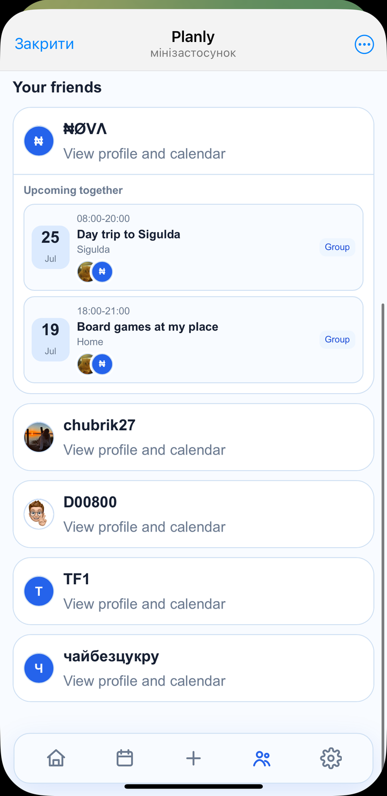
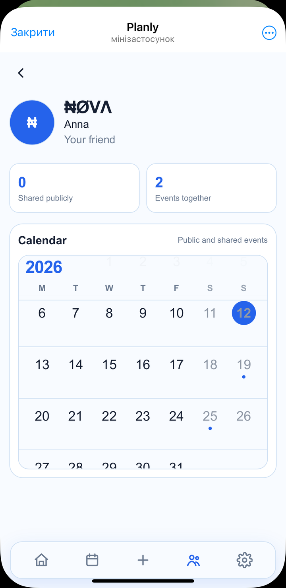
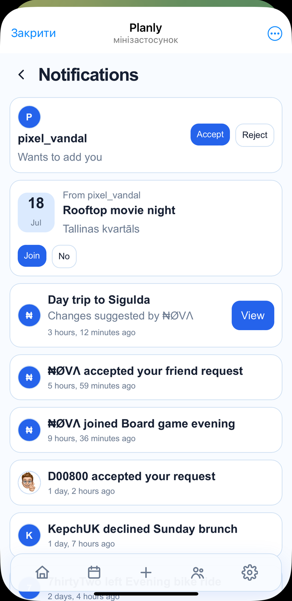

# Planly

Planly is a shared calendar for personal events, private reminders, friend
calendars, and collaborative plans.

The project runs as a Telegram Mini App.

[Open Planly in Telegram](https://t.me/Planly_OctoBot)

> Status: functional portfolio MVP.

<p align="center">
  
</p>

## About

Planly combines a personal calendar with lightweight social planning. Users can
keep reminders private, share events that friends can see, or create group events
where invited participants can accept, decline, leave, and suggest changes.

The interface is designed for mobile use inside Telegram, while the backend
keeps private, shared, and public data separated for each user.

## Features

- Personal events with optional start and end times
- Private reminders with repeat and completion settings
- Scrollable monthly calendar with event and reminder indicators
- Daily event details directly inside the calendar
- Friend requests and friend profiles
- Public friend calendars and shared-event visibility
- Group events with invitations and participant statuses
- Event change proposals with owner approval
- In-app notifications with read state and swipe-to-delete actions
- Telegram Mini App authentication
- Telegram profile and avatar synchronization
- User-level access control for private and shared data

## Screenshots

<table>
  <tr>
    <td align="center">
      <br>
      <strong>Calendar</strong>
    </td>
    <td align="center">
      <br>
      <strong>Day details</strong>
    </td>
  </tr>
  <tr>
    <td align="center">
      <br>
      <strong>Create an event</strong>
    </td>
    <td align="center">
      <br>
      <strong>Group planning</strong>
    </td>
  </tr>
  <tr>
    <td align="center">
      <br>
      <strong>Friends</strong>
    </td>
    <td align="center">
      <br>
      <strong>Friend calendar</strong>
    </td>
  </tr>
  <tr>
    <td align="center" colspan="2">
      <br>
      <strong>Notifications</strong>
    </td>
  </tr>
</table>

## Technical Highlights

- Validates Telegram Mini App init data before authenticating a user
- Uses PostgreSQL hosted on Supabase for persistent application data
- Stores user avatars in Supabase Storage
- Restricts private and shared objects through user-scoped Django queries
- Models multi-step group workflows for invitations and change proposals
- Uses environment-based settings for local development and production
- Serves static files with WhiteNoise and runs on Vercel
- Includes automated tests for models, forms, permissions, views, and Telegram authentication

## Tech Stack

- Python 3.13
- Django 6
- PostgreSQL
- Supabase Database and Storage
- Django ORM
- Django Templates
- HTML and CSS
- Telegram Mini Apps
- Vercel
- WhiteNoise
- uv

## Architecture

```text
Telegram Mini App / Browser
            |
            v
      Django on Vercel
        |           |
        v           v
Supabase Postgres  Supabase Storage
  application data    avatars
```

Django handles authentication, permissions, calendar logic, invitations,
notifications, and HTML rendering. PostgreSQL stores application data, while
Supabase Storage keeps uploaded and synchronized avatars outside the Vercel
filesystem.

## Local Setup

### 1. Clone the repository

```bash
git clone https://github.com/OctNazy/planly.git
cd planly
```

### 2. Install dependencies

Install [uv](https://docs.astral.sh/uv/) if it is not already available, then run:

```bash
uv sync
```

### 3. Create the environment file

```bash
cp .env.example .env
```

At minimum, replace `SECRET_KEY` in `.env`. Local development can use SQLite
when `DATABASE_URL` is empty and Supabase Storage is disabled.

### 4. Apply migrations

```bash
uv run python manage.py migrate
```

### 5. Start the development server

```bash
uv run python manage.py runserver
```

Open `http://127.0.0.1:8000/` in a browser.

## Environment Variables

The complete development template is available in `.env.example`.

| Variable | Purpose |
| --- | --- |
| `SECRET_KEY` | Django cryptographic signing key |
| `DEBUG` | Enables or disables Django debug mode |
| `ALLOWED_HOSTS` | Hosts allowed to serve the application |
| `CSRF_TRUSTED_ORIGINS` | Trusted HTTPS origins for CSRF validation |
| `DATABASE_URL` | PostgreSQL connection string |
| `SUPABASE_STORAGE_ENABLED` | Enables persistent avatar storage |
| `SUPABASE_STORAGE_*` | Supabase S3-compatible storage configuration |
| `TELEGRAM_BOT_TOKEN` | Validates Telegram Mini App authentication data |
| `TELEGRAM_AUTH_MAX_AGE_SECONDS` | Maximum accepted age of Telegram authentication data |

Never commit the local `.env` file or real credentials.

## Tests

Run the complete test suite with:

```bash
uv run python manage.py test
```

The current suite contains 46 tests covering core models, forms, permissions,
friend and event workflows, notifications, and Telegram authentication.

## Future Improvements

- Improve application performance and loading speed
- Send selected notifications through the Telegram Bot API
- Add reminder delivery instead of storing reminders only in the application
- Add availability conflict warnings before sending group invitations
- Allow invited users to propose additional participants
- Add a separate archive for events older than one year
